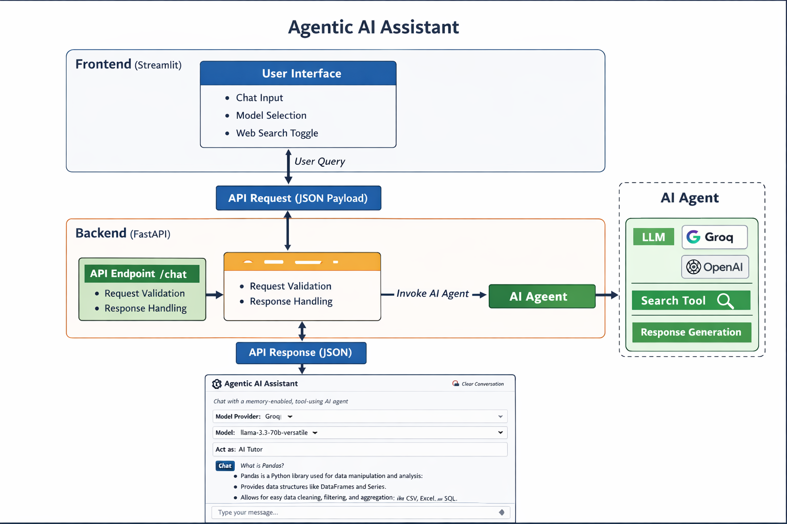
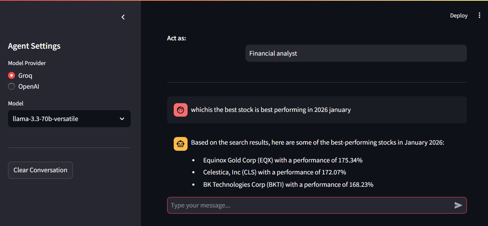

# Agentic AI Assistant

## 1. Project Introduction

This project implements an **Agentic AI Assistant** that allows users to interact with a large language model through a web-based chat interface.
The assistant supports:

* Multiple LLM providers (Groq, extensible to OpenAI)
* Tool-augmented reasoning using web search
* Conversation memory
* A clear separation between frontend, backend, and AI agent logic

The system is designed to be modular, readable, and extensible for real-world AI applications.

### System architecture




---

## 2. Project Structure

```
project_root/
│
├── frontend.py        # Streamlit user interface
├── backend.py         # FastAPI backend service
├── ai_agent.py        # AI agent and LLM orchestration logic
├── images/
│   ├── system_architecture.png
│   └── output_chat.png
├── requirements.txt   # Python dependencies
└── README.md
```

---

## 3. File-Level Explanation

### 3.1 `frontend.py` — Streamlit UI

**Purpose:**
Provides a browser-based chat interface for interacting with the AI assistant.

**Responsibilities:**

* Renders the chat UI
* Allows users to:

  * Select model provider and model
  * Enable or disable web search
  * Enter a system prompt
* Maintains chat history using Streamlit session state
* Sends user requests to the backend API
* Displays AI responses in conversational format

**Key Output:**
A live chat interface accessible via a web browser.

---

### 3.2 `backend.py` — FastAPI Backend

**Purpose:**
Acts as the communication layer between the frontend and the AI agent.

**Responsibilities:**

* Defines API contracts using Pydantic models
* Validates incoming requests
* Extracts user messages from conversation history
* Invokes the AI agent with required parameters
* Returns structured JSON responses

**Exposed Endpoint:**

| Method | Endpoint | Description                                      |
| ------ | -------- | ------------------------------------------------ |
| POST   | `/chat`  | Processes chat requests and returns AI responses |

**Key Output:**
JSON response containing the AI-generated message.

---

### 3.3 `ai_agent.py` — AI Agent Logic

**Purpose:**
Encapsulates all AI-related logic, including LLM selection and tool usage.

**Responsibilities:**

* Loads API keys from environment variables
* Initializes the selected LLM dynamically
* Configures optional tools (Tavily web search)
* Creates a ReAct-based agent using LangGraph
* Executes the agent workflow and extracts the final response

**Key Output:**
A single, final AI-generated response string.

---

## 4. Execution Flow

1. User enters a message in the Streamlit UI
2. Frontend sends a POST request to the FastAPI backend
3. Backend validates input and extracts user messages
4. Backend calls the AI agent
5. AI agent:

   * Applies the system prompt
   * Uses tools if enabled
   * Generates a response
6. Backend returns the response
7. Frontend displays the response and updates conversation memory

---

## 5. Prerequisites

* Python 3.9 or higher
* Groq API Key
* Tavily API Key (required only if web search is enabled)

---

## 6. Environment Setup

Set the following environment variables:

```bash
export GROQ_API_KEY="your_groq_api_key"
export TAVILY_API_KEY="your_tavily_api_key"
```

(Optional) If using a `.env` file:

```python
from dotenv import load_dotenv
load_dotenv()
```

---

## 7. Install Dependencies

```bash
pip install -r requirements.txt
```

---

## 8. How to Run the Application

### Step 1: Start the Backend (FastAPI)

```bash
python backend.py
```

Backend will start at:

```
http://127.0.0.1:9999
```

Swagger documentation available at:

```
http://127.0.0.1:9999/docs
```

---

### Step 2: Start the Frontend (Streamlit)

```bash
streamlit run frontend.py
```

The UI will open automatically in your browser.

---

## 9. Expected Output

### Frontend Output

* A chat interface where:

  * Users can enter questions
  * AI responses appear in real time
  * Conversation history is preserved
  * Model and tool selection is configurable





### Backend Output

* JSON responses in the following format:

```json
{
  "response": "Generated AI answer based on the query"
}
```

---

## 10. Error Handling

* Invalid model names return a structured error response
* API failures are displayed in the frontend UI
* Conversation state can be cleared using the sidebar control

---

## 11. Extensibility

This project can be extended to support:

* Additional LLM providers (OpenAI, Anthropic, etc.)
* Custom tools (databases, APIs, vector stores)
* Authentication and rate limiting
* Deployment using Docker or cloud platforms

---

## 12. Summary

This project demonstrates a clean and modular implementation of an **Agentic AI Assistant** using modern AI orchestration techniques.
It is suitable for learning, internal tools, and as a foundation for production-grade AI systems.

